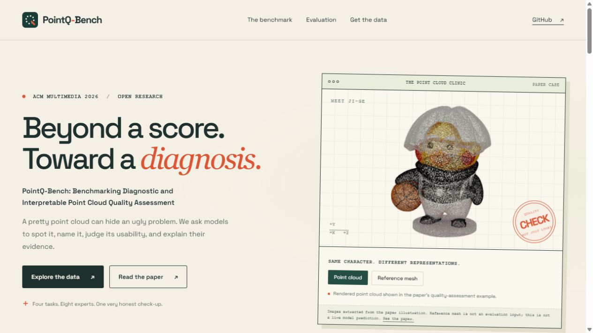

# PointQ-Bench

### Beyond a score. Toward a diagnosis.

Official repository for **PointQ-Bench: Benchmarking Diagnostic and
Interpretable Point Cloud Quality Assessment**, accepted by **ACM Multimedia
2026**.

[Paper](docs/assets/pointq-bench-paper.pdf) |
[Project page source](docs/) |
[Data download](https://pan.baidu.com/s/1oHoVxMzDVNkyiV40wphWzw?pwd=4vi1) |
[Evaluation guide](evaluation/README.md) |
[Data card](data/README.md)

Duanchu Wang*, Cheng Li*, Junjie Yang, Jing Huang, Zihang Cheng, Zhi Gao,
Bohong Zhu, Di Wang. *Equal contribution.

Xi'an Jiaotong University and University of Chinese Academy of Sciences.

PointQ-Bench asks a model to **spot an anomaly, name the defect, judge
usability, and explain the evidence**. It extends point cloud quality
assessment beyond a single scalar prediction, with 3,083 point clouds,
eight experts per sample, 12,332 question-answer pairs, and evaluation of
14 2D MLLMs and native 3D VLMs.

The project page takes the form of a playful "point cloud clinic", featuring
the Ji-ge cartoon from the paper's quality-assessment illustration. Switch
between its rendered point cloud and original mesh. The mesh is visual
reference only, not an evaluation input; this is not live model inference.



## Available Now

| Asset | Contents | Access |
| --- | --- | --- |
| Point clouds | 3,083 files, seven sources | [Baidu mirror](https://pan.baidu.com/s/1oHoVxMzDVNkyiV40wphWzw?pwd=4vi1) |
| Six-view projections | 18,498 PNGs, six per cloud | Same Baidu folder |
| Manifest and checksums | Per-cloud identity/hash and archive/part hashes | [data/](data/) |
| Merge and integrity tools | Standard-library Python, no account credentials | [scripts/](scripts/) |
| Perception judge | Yes/No accuracy, What sample-level F1, How macro-F1 | [evaluation/](evaluation/) |
| SSFRQ-5D judge | Five ordinal dimensions, each scored 0/1/2 | [evaluation/](evaluation/) |
| Paper and static project page | Camera-ready paper, citation, clinic demo | [docs/](docs/) |

**Staged release:** expert annotation bundles, question CSVs, model QA,
judge/SSFRQ result bundles, inference adapters, and full paper-table assembly
are not included in this initial package. They will be released separately
after formal version pairing. There is no provisional leaderboard here.
The evaluators require external predictions and reference assets; synthetic
offline tests do not prove full paper reproduction.

## Download and Verify

**[Baidu Netdisk: PointQ-Bench-v1.0](https://pan.baidu.com/s/1oHoVxMzDVNkyiV40wphWzw?pwd=4vi1)**

Extraction code: **`4vi1`**. The link is permanent.

The cloud archive exceeds the website's single-file upload limit, so download
**all four** `PointQ-Bench_pointclouds_v1.0.zip.001` through `.004` parts.
These are byte parts, not standalone ZIPs. Put the four parts, the parts
checksum file, and `merge_pointcloud_parts.py` from the share in one folder:

```sh
python merge_pointcloud_parts.py
```

Then unzip the reconstructed `PointQ-Bench_pointclouds_v1.0.zip`. Unzip
`PointQ-Bench_screenshots_mv6_v1.0.zip` separately. Keep data outside Git.

From this repository, verify the extracted cloud directory:

```sh
python scripts/verify_data.py --cloud-root /path/to/clouds
```

[Detailed data layout, hashes, and instructions](data/README.md).
The local archives passed full CRC and per-file SHA-256 checks. The share's
nine-file listing has been verified; complete remote re-download verification
has not yet been performed.

## Evaluate

Python 3.10+ is required for the source-derived evaluators. API-backed judge
runs can incur costs; use a supported OpenAI-compatible endpoint and your
own securely configured credentials. No API keys or model weights are bundled.

```sh
python -m pip install --upgrade pip
python -m pip install -r evaluation/requirements.txt
python -m evaluation.run_main_judge --help
python -m evaluation.run_reasoning_ssfrq5d --help
python -m evaluation.merge_judge_shards --help
```

Reference CSVs and final-protocol JSONs are separate inputs. The
[evaluation guide](evaluation/README.md) documents their schemas,
environment variables, exact commands, endpoint caveats, cache boundaries,
and the distinction between AI-aggregated references and human comments.

Run the offline tests without invoking paid models:

```sh
python -m unittest discover -s tests -v
python -m unittest discover -s scripts/tests -v
python -m unittest discover -s site-tests -v
```

Preview the project page locally:

```sh
python -m http.server 8000 --bind 127.0.0.1 --directory docs
```

Open `http://127.0.0.1:8000/`. There is no frontend install or build step.
For GitHub Pages, publish `main` / `docs` after approving the release; see
[deployment instructions](docs/DEPLOYMENT.md).

## Citation

```bibtex
@inproceedings{wang2026pointqbench,
  title = {PointQ-Bench: Benchmarking Diagnostic and Interpretable Point Cloud Quality Assessment},
  author = {Wang, Duanchu and Li, Cheng and Yang, Junjie and Huang, Jing and Cheng, Zihang and Gao, Zhi and Zhu, Bohong and Wang, Di},
  booktitle = {Proceedings of the 34th ACM International Conference on Multimedia},
  year = {2026},
  doi = {10.1145/3767308.3836267}
}
```

DOI and authors match the supplied camera-ready paper. Citation metadata is
also in [CITATION.cff](CITATION.cff).

## Licenses

Self-owned code and the website use [MIT](LICENSE). The paper identifies
CC BY 4.0. Data rights remain source-dependent: MIT does **not** relicense
LiDAR-Net, T23D-CompBench, CO3D, ModelNet40-C, ScanObjectNN, SJTU-PCQA, or WPC.
See [asset and third-party notices](THIRD_PARTY_NOTICES.md).
